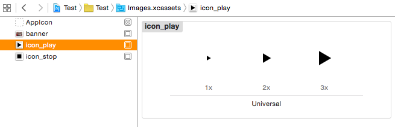

Rauto Plugin for Xcode
======================

This Xcode Plugin make you access resources like `colors`, `images` or `localizable strings` easier and more accurately. It provides functions like `Android Resource Manager` in Swift.

It generates references for colors, images and localizable strings <del>automatically</del>. (It will be supported in the next version)

Usage
-----

###Strings

Get strings by calling `string(R.string.{string_name})`

```swift
let str: String = string(R.string.hello_world)
```

Or use the abbreviated form

```swift
let str: String = string(.hello_world)
```

If you have some localizable string files, the `string(R.string.{string_name})` will show the text in your language.

* `Base.lproj/Localizable.strings`

```
// titles
"title1" = "Title 1";
"title2" = "Title 2";

// hello world
"hello_world" = "Hello, world!";
```

* `es.lproj/Localizable.strings`

```
// titles
"title1" = "título 1";
"title2" = "título 2";

// hello world
"hello_world" = "Hola mundo!";
```			

###Images

Assume there is any `*.xcassets` folder in your project

* `Images.xcassets`



Get images by calling `image(R.string.{image_name})`

```swift
imageView.image = image(R.image.icon_play)
```

or

```swift
imageView.image = image(.icon_play)
```

###Colors

Create a `Color.strings` file first and define some colors you like. The hex code of colors should follow `#RRGGBB`, `#RGB`, `#AARRGGBB` or `#ARGB` rules.

* `Color.strings`

```
// colors
"dark_red"       = "#8B0000";
"popcorn_yellow" = "#FAA";
"lake_michigan"  = "#DE50A6C2";
"cat_eye"        = "#EBE5";
```

And get colors by calling `color(R.color.{color_name})`

```swift
view.backgroundColor = color(R.color.popcorn_yellow)
```

or

```swift
view.backgroundColor = color(.popcorn_yellow)
```

... 

####Java-like Syntax

`Rauto` supports the `Java-like syntax` if you used to code `Java`. But still suggest using a `Swift syntax`.

```swift
getString(R.string.hello_world)
getString(.hello_world)

getImage(R.image.icon_play)
getImage(.icon_play)

getColor(R.color.popcorn_yellow)
getColor(.popcorn_yellow)
```

How to Install
--------------

<del>Install it via <a href="http://alcatraz.io/">Alcatraz</a></del> (Not yet)<br />
or

1. `Clone` this repository and `build` it.
2. `Restart` Xcode

or

1. Download and unzip a <a href="https://github.com/azurechen/Rauto/releases">release</a> to `~/Library/Application Support/Developer/Shared/Xcode/Plug-ins`
2. `Restart` Xcode

After restarting Xcode, open any project and 

1. Click `Product` -> `Rauto` -> `Sync`
2. If you don't use Rauto in this project anymore, click `Product` -> `Rauto` -> `Clean` 

